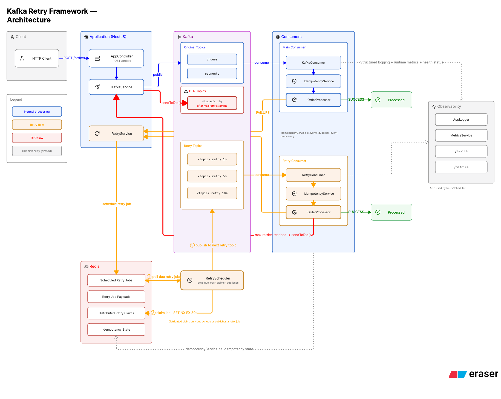
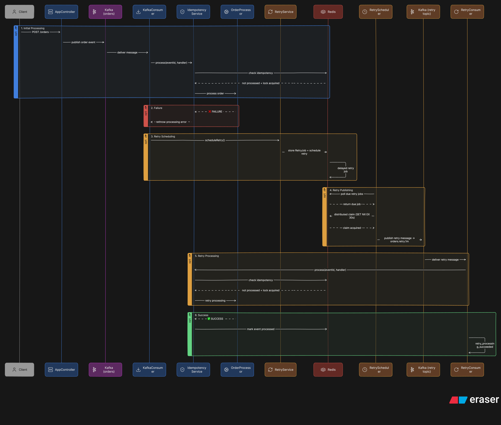

# Kafka Retry Framework

A **production-oriented Kafka retry framework** built with **NestJS, Kafka, and Redis** — the failure-handling layer Kafka itself does not provide.

**Capabilities**

- ⏱️ **Delayed retries** — a failed event waits in Redis, not in the partition
- 🔒 **Idempotent processing** — a stable `eventId` makes at-least-once delivery safe to replay
- 🪜 **Tiered retry topics** — one topic per attempt: `orders.retry.1m` → `.5m` → `.10m`
- 🔐 **Distributed retry-job claiming** — an atomic Redis `SET NX EX` that elects one instance to publish each retry job
- 🪦 **DLQ handling** — events that exhaust every tier land on a terminal dead-letter topic
- 🧾 **Structured logging** — one JSON line per event, stamped with `instanceId`
- 📊 **Metrics** — runtime counters and retry latency at `GET /metrics`
- ❤️ **Health monitoring** — `GET /health` returns `503` when Redis or Kafka is degraded

> **"Production-oriented", not "production-grade."** The [Known Limitations](#-known-limitations) section documents exactly where this stops short of a production deployment — single-node infrastructure, in-memory metrics, and no usable test suite.

---

## 📚 Table of Contents

- [Overview](#-overview)
- [What This Project Demonstrates](#-what-this-project-demonstrates)
- [Architecture Overview](#-architecture-overview)
- [Request / Message Lifecycle](#-request--message-lifecycle)
- [Complete Retry Flow](#-complete-retry-flow)
- [Why Kafka + Redis?](#-why-kafka--redis)
- [Architecture & Design Patterns](#-architecture--design-patterns)
- [Redis Retry Design](#-redis-retry-design)
- [Reliability & Failure Handling](#-reliability--failure-handling)
- [Observability](#-observability)
- [Component Deep Dive](#-component-deep-dive)
- [Key Design Decisions](#-key-design-decisions)
- [Tech Stack](#-tech-stack)
- [Project Structure](#-project-structure)
- [API Endpoints](#-api-endpoints)
- [Environment Variables](#-environment-variables)
- [Docker Architecture](#-docker-architecture)
- [Quick Start](#-quick-start)
- [Getting Started](#-getting-started)
- [Testing the Retry Flow](#-testing-the-retry-flow)
- [Example Failure Scenario](#-example-failure-scenario)
- [Failure & Recovery Scenarios](#-failure--recovery-scenarios)
- [Known Limitations](#-known-limitations)
- [Future Improvements](#-future-improvements)

---

## 🚀 Overview

Kafka gives you durable event transport and ordered delivery within a partition, but it does not provide application-level delayed retry scheduling or a built-in retry/DLQ policy. A consumer that throws has three bad options: crash, silently drop the message, or block the partition retrying forever. None are acceptable when the failure is transient (a downstream API is down for 30 seconds).

This project implements the missing layer:

| Problem | How this framework solves it |
|---|---|
| A message fails processing | It is scheduled for a **delayed retry** instead of being dropped or blocking the partition |
| Retries need to wait minutes, not milliseconds | Kafka can't delay delivery, so the job is parked in a **Redis sorted set** keyed by due-time |
| Multiple app instances all see the same due job | An atomic **Redis `SET NX` claim** elects one instance to publish the retry job |
| Kafka redelivers a message (at-least-once) | An **idempotency layer** keyed on a stable `eventId` skips already-processed events |
| A message can never succeed | After `MAX_RETRIES` it is routed to a **dead-letter topic** for inspection |

**Why Redis rather than Kafka alone?** Kafka has no native "deliver this message in 5 minutes" primitive. The common workaround — consuming a delay topic and `sleep()`ing — blocks the partition and breaks consumer-group liveness. Instead, a failed message's *metadata* is stored in a Redis ZSET scored by its due timestamp. A poller asks Redis "what's due now?", which is an `O(log n)` range query, and only then republishes to Kafka. Kafka stays the transport; Redis is the scheduler.

**Why tiered retry topics?** Each retry attempt is republished to its own topic (`orders.retry.1m`, `orders.retry.5m`, `orders.retry.10m`). This keeps attempt-number visible in the topology, makes lag per tier observable in Kafka UI, and isolates slow retries from first-attempt traffic.

---

## 🎯 What This Project Demonstrates

Everything listed here is implemented in this repository and exercised by the walkthroughs below.

| Capability | Where it lives |
|---|---|
| **Kafka producers and consumer groups** | `KafkaService` producer/admin; two groups — `order-consumer-group` and `order-retry-consumer-group` |
| **Delayed message processing** | Retry jobs become due at `scheduledRetryAt`, published only once that time passes |
| **Redis sorted sets for retry scheduling** | `retry:scheduled` ZSET scored by due-timestamp, queried with `ZRANGEBYSCORE` |
| **Redis `SET NX EX` distributed claiming** | `tryClaimRetryJob()` — one atomic op elects a single publisher per job |
| **At-least-once processing handling** | Offsets advance on failure; duplicates are expected and absorbed rather than prevented |
| **Idempotent event processing** | `IdempotencyService` check → lock → run → mark, keyed on a stable `eventId` |
| **Retry escalation** | `RetryConsumer` re-schedules to the next tier while `retryCount < maxRetries` |
| **Dead-letter queues** | `sendToDlq()` publishes to `<originalTopic><DLQ_SUFFIX>` with an `error_message` header |
| **Failure recovery** | Claim TTL expiry, publish-failure retention in Redis, AOF persistence, graceful SIGTERM shutdown |
| **Structured logging** | `AppLogger` — one JSON object per line, every line stamped with `instanceId` |
| **Runtime metrics** | `MetricsService` counters plus a retry-latency accumulator at `GET /metrics` |
| **Dockerized infrastructure** | Compose stack: Kafka (KRaft), Redis (AOF), Kafka UI, and the Nest app with health-gated startup |

---

## 🏗️ Architecture Overview



**Reading the diagram:**

- 🔵 **Blue** — the normal processing path: HTTP → Kafka → consumer → business logic
- 🟠 **Orange** — the retry flow: failure → Redis → scheduler → retry topic
- 🔴 **Red** — the DLQ path taken once retries are exhausted
- ⚪ **Dotted lines** — observability: logs, metrics, and health checks

### Components

| Component | File | Responsibility |
|---|---|---|
| **AppController** | `src/app.controller.ts` | `POST /orders`. Mints a stable `event_id` (or accepts one) and publishes to the `orders` topic. Produces only — never processes. |
| **KafkaService** | `src/kafka/kafka.service.ts` | Owns the KafkaJS **producer** and **admin** client. Creates required topics at startup, publishes original/retry/DLQ messages, and exposes producer-connected state for `/health`. |
| **KafkaConsumer** | `src/kafka/kafka.consumer.ts` | Subscribes to every topic in `KAFKA_ORIGINAL_TOPICS` (group `order-consumer-group`). Extracts `event_id`, delegates to idempotency + processing, schedules retry #1 on failure. |
| **IdempotencyService** | `src/idempotency/idempotency.service.ts` | Wraps business logic in a check-lock-run-mark cycle keyed on `eventId`: concurrent deliveries cannot process the same event at once, and a normal redelivery of an already-succeeded event is skipped. |
| **OrderProcessor** | `src/orders/order.processor.ts` | The business logic seam. Both consumers call it, so retry behaviour is identical to first-attempt behaviour. Currently a stub with a failure switch. |
| **RetryService** | `src/retry/retry.service.ts` | Builds a `RetryJob` (new `jobId`, resolved retry topic, computed due time) and stores it in Redis. |
| **RedisService** | `src/redis/redis.service.ts` | Single access layer for all Redis state: retry queue, job payloads, distributed claims, idempotency keys. |
| **RetryScheduler** | `src/retry/retry.scheduler.ts` | Polls Redis for due jobs, claims each one atomically, republishes it to its retry topic, then deletes it. Runs in **every** instance. |
| **RetryConsumer** | `src/kafka/retry.consumer.ts` | Subscribes to all generated retry topics (group `order-retry-consumer-group`). Re-runs processing through the idempotency gate, then escalates the event to the next retry tier or to the DLQ. |
| **MetricsService** | `src/common/metrics/metrics.service.ts` | In-process counters + retry-latency accumulator, served at `/metrics`. |
| **AppLogger** | `src/common/logger/app.logger.ts` | `@Global()` structured JSON logger. Stamps every line with `instanceId`. |
| **HealthController** | `src/health/health.controller.ts` | `GET /health`. Pings Redis and checks the Kafka producer; returns `503` when degraded. |

---

## 🔄 Request / Message Lifecycle

```
Client
  → AppController          POST /orders, mints/accepts event_id
    → KafkaService         producer.send(...)
      → Kafka              original topic ("orders")
        → KafkaConsumer    group: order-consumer-group
          → IdempotencyService   check → lock → run → mark
            → OrderProcessor     business logic
```

1. **`POST /orders`** — `AppController` builds an order payload. `event_id` comes from the request body if supplied, otherwise `randomUUID()`. This id is the **stable business identity** that survives every retry.
2. **Publish** — `KafkaService.sendMessage('orders', order)` writes the JSON payload. The HTTP request returns immediately; processing is fully asynchronous.
3. **Consume** — `KafkaConsumer` receives the message and parses `event_id` out of the JSON body. A message with unparseable JSON or no `event_id` is logged and dropped (no retry).
4. **Idempotency gate** — `IdempotencyService.process(eventId, handler)` checks whether this event already succeeded, then takes an atomic processing lock.
5. **Process** — `OrderProcessor.process(value)` runs the business logic.

**On success:** the event is marked processed (`idempotency:processed:<eventId>`, 24h TTL), the processing lock is released, and `messages_processed` increments. Any later redelivery of the same `event_id` is skipped.

**On failure:** the lock is released in a `finally` block, the error propagates back to the consumer, `messages_failed` increments, and `RetryService.scheduleRetry(..., retryCount = 1, ...)` parks the job in Redis. The Kafka offset still advances — the retry now lives in Redis, not in the partition, so the consumer is never blocked.

---

## 🔁 Complete Retry Flow



### Step by step

1. **Message arrives** on an original topic and `KafkaConsumer` picks it up.
2. **Processing runs** through the idempotency gate into `OrderProcessor`.
3. **Processing fails** — the handler throws.
4. **`RetryService` builds a `RetryJob`** with a fresh `jobId` (`randomUUID()`), the inherited `eventId`, the resolved `retryTopic`, and `scheduledRetryAt = now + retryDelay`.
5. **Payload stored** at `retry:job:<jobId>` as JSON.
6. **Job enqueued** via `ZADD retry:scheduled <scheduledRetryAt-epoch-ms> <jobId>`.
7. **`RetryScheduler` polls** every `RETRY_SCHEDULER_INTERVAL_MS` with `ZRANGEBYSCORE retry:scheduled -inf <now>`, then `MGET`s the payloads.
8. **Claim attempted** per job: `SET retry:claim:<jobId> 1 EX 30 NX`.
9. **One instance wins.** Losers get `nil`, log `retry_job_claim_failed`, and `continue` — no duplicate publish.
10. **Retry published** by the winner to `job.retryTopic`, carrying headers `job_id`, `event_id`, `retry_count`, `max_retries`, `original_topic`, `scheduled_retry_at`.
11. **Job removed** — `ZREM` + `DEL` — *only after* the publish resolves.
12. **`RetryConsumer` consumes** the retry message and validates all six headers.
13. **Idempotency re-checked** on the same `eventId`. If the event already succeeded elsewhere, the retry is skipped.
14. **Succeeds → done.** **Fails and `retryCount < maxRetries` →** `scheduleRetry(retryCount + 1)`, landing in the next tier.
15. **Fails and `retryCount == maxRetries` →** `sendToDlq()` publishes to `<originalTopic>.dlq` with an `error_message` header.

### Retry policy

With the documented default configuration — `MAX_RETRIES=3`, `RETRY_DELAYS_MS=60000,300000,600000`:

| Attempt | Topic | Delay |
|---|---|---:|
| Original | `orders` | Immediate |
| Retry 1 | `orders.retry.1m` | 1 min |
| Retry 2 | `orders.retry.5m` | 5 min |
| Retry 3 | `orders.retry.10m` | 10 min |
| Exhausted | `orders.dlq` | Terminal |

That's **4 total processing attempts** (1 original + 3 retries) spanning ~16 minutes before a message reaches the DLQ. Both the delays and the tier count are env-driven, so this ladder is the default, not a hardcoded policy.

---

## 🤔 Why Kafka + Redis?

Two stores, two jobs: Kafka moves events, Redis decides *when* an event moves again.

### Why Kafka?

Durable event transport. Messages are persisted on the broker rather than held in process memory, consumer groups distribute partitions across instances and rebalance when one dies, partitioning gives ordering within a key, and retained offsets make history replayable. The retry layer is built *on top of* those guarantees rather than replacing them.

### Why Redis?

Kafka has no native "deliver this message after N minutes" primitive — delivery is driven by consumer position, not wall-clock time. Redis supplies the missing scheduler: a sorted set (`retry:scheduled`) scored by due-timestamp turns "which jobs are due now?" into a single `O(log n + m)` range query, with no per-job timers to hold and no scanning. Redis also backs the two pieces of coordination state the framework needs — the `SET NX EX` publish claim and the idempotency keys.

### Why not sleep inside the Kafka consumer?

The obvious shortcut is to consume a delay topic and `sleep()` until the message is due. That keeps the consumer tied up for the entire delay: the partition it owns makes no progress, every message queued behind the sleeping one waits too, and if the delay outlives `max.poll.interval.ms` the broker considers the consumer dead and rebalances the group.

Parking the wait outside Kafka avoids all three. The consumer returns immediately, the offset advances, the partition stays live, and the retry waits as a row in Redis — where a 10-minute delay costs one ZSET entry instead of one blocked consumer.

---

## 🧩 Architecture & Design Patterns

| Pattern / Concept | Where Used | Purpose |
|---|---|---|
| Dependency Injection | NestJS services | Loose coupling |
| Producer-Consumer | Kafka | Async event processing |
| Idempotency | `IdempotencyService` | Prevent duplicate business processing |
| Distributed Lock | Redis `SET NX EX` | Single retry publisher |
| Delayed Queue | Redis ZSET | Schedule future retries |
| Retry Escalation | Retry topics | Move failed events through retry tiers |
| Dead Letter Queue | Kafka DLQ topics | Terminal handling of exhausted retries |

---

## 🧠 Redis Retry Design

### Retry scheduling keys

| Key | Type | TTL | Purpose |
|---|---|---|---|
| `retry:scheduled` | ZSET | none | The due-time index. Member = `jobId`, **score = `scheduledRetryAt` in epoch ms**. |
| `retry:job:<jobId>` | String (JSON) | none | The full `RetryJob` payload. |
| `retry:claim:<jobId>` | String | **30s** | Distributed ownership lease held by whichever instance is publishing that job. |

**Why a ZSET?** The scheduler's only question is *"which jobs are due now?"* — a range query over time. A sorted set scored by due-timestamp answers that in `O(log n + m)` via `ZRANGEBYSCORE key -inf <now>`, with no scanning and no per-job timers.

**Why a separate `retry:job:` key instead of storing JSON in the ZSET member?** ZSET members must be unique. Storing the payload as the member would make two structurally-identical retries collide into one entry, silently losing a retry. Keeping `jobId` as the member guarantees uniqueness; the payload is fetched in bulk with a single `MGET`.

**The `RetryJob` payload** (`src/redis/retry-job.ts`):

```ts
interface RetryJob {
  jobId: string;            // identity of THIS retry attempt (new every time)
  eventId: string;          // identity of the BUSINESS EVENT (stable across all retries)
  value: string;            // the original Kafka message payload, unmodified
  retryCount: number;       // which attempt this is (1-based)
  retryTopic: string;       // resolved destination, e.g. "orders.retry.5m"
  originalTopic: string;    // where the failure originated, e.g. "orders"
  scheduledRetryAt: string; // ISO-8601; becomes the ZSET score
}
```

The `jobId` / `eventId` split is what makes the system debuggable: `jobId` traces one publish attempt, `eventId` traces the business event across every tier from first failure to DLQ.

### Why distributed claiming is required

`getDueRetryJobs()` returns a **snapshot**. When three instances poll within the same second, all three receive the same due job. Without coordination, all three would publish it — three duplicate Kafka messages per retry.

`tryClaimRetryJob()` closes this with a single atomic operation:

```
SET retry:claim:<jobId> 1 EX 30 NX
```

`NX` means *create only if absent*. Redis executes it atomically, so exactly one instance receives `OK` and the rest receive `nil`. There is no check-then-set window to race through.

### Why the claim is left to expire rather than released

This is the subtle part, and it was a real bug found and fixed during development.

The intuitive cleanup — releasing the claim right after a successful publish — **reintroduces the duplicate it was meant to prevent**. Instances iterate their own stale snapshots; if instance A publishes, removes the job, and frees the claim within milliseconds, instance B can reach that same job in its snapshot moments later, successfully re-claim the now-free key, and publish it a second time.

So `RetryScheduler` deliberately **never** calls `releaseRetryJobClaim()`. The claim is allowed to expire naturally after 30s — long enough to outlive any in-flight snapshot. Because the job itself is already deleted from Redis, the lingering claim key blocks nothing legitimate.

> The `releaseRetryJobClaim()` method still exists on `RedisService` but is intentionally uncalled. It is kept as an explicit, documented decision rather than deleted.

The 30s TTL also provides crash recovery: if the winning instance dies mid-publish, the claim expires and another instance picks the job up on a later cycle.

### Idempotency keys

| Key | TTL | Set with | Meaning |
|---|---|---|---|
| `idempotency:processing:<eventId>` | **300s** (5 min) | `SET ... EX 300 NX` | A handler is currently running for this event. |
| `idempotency:processed:<eventId>` | **86400s** (24h) | `SET ... EX 86400` | This event completed successfully; skip any redelivery. |

The processing lock's TTL is a safety valve: if a process dies mid-handler, the lock expires instead of blocking the event forever. The processed marker expires after 24 hours to bound memory — duplicates arriving later than that would be reprocessed.

---

## 🛡️ Reliability & Failure Handling

### Idempotency

`IdempotencyService.process()` runs a three-step gate: check `idempotency:processed:<eventId>` → take `idempotency:processing:<eventId>` with `NX` → run the handler. The processed marker is written **only after the handler resolves successfully**, and the processing lock is always released in a `finally`. Marking before processing would risk recording success for work that never happened.

### Duplicate retry delivery

Both consumers route through the same gate on the same `eventId`. Because `eventId` is inherited by every `RetryJob` and propagated as the `event_id` Kafka header, an event that succeeded on retry 2 will be skipped if retry 1's message is somehow redelivered. The duplicate is logged (`duplicate_event_skipped`) and `duplicate_events` increments.

### Invalid messages

- **`KafkaConsumer`** — unparseable JSON logs `invalid_json_message`; a missing `event_id` logs `message_missing_event_id`. Both `return` early: **no retry is scheduled**, because without a stable identity the framework cannot offer idempotency or trace the event.
- **`RetryConsumer`** — validates all six expected headers plus numeric parsing of `retry_count`/`max_retries` and date parsing of `scheduled_retry_at`. Any failure logs `invalid_retry_message_headers` with the specific missing fields and drops the message. These headers are written by this framework's own producer, so a malformed one means a foreign producer or corruption — guessing at defaults would be worse than rejecting.

### Retry publish failure

If `publishRetryJob()` throws, the `catch` logs `retry_job_publish_failed` and **does nothing else** — deliberately. `removeRetryJob()` is never reached, so the job stays in `retry:scheduled`. The claim expires after 30s and any instance can retry the publish on a later cycle. The job is not lost.

### Redis persistence

Redis runs with `--appendonly yes` (AOF) and a named `redis-data` volume. Retry jobs and idempotency keys survive container restarts and recreation, not just process restarts. AOF's default `everysec` fsync means up to ~1 second of writes can be lost on an unclean host crash.

### Kafka restart / recovery

Kafka uses KRaft with a named `kafka-data` volume, so topics and committed offsets persist across restarts. `RedisService` registers an `error` listener so connection drops surface as structured `redis_connection_error` logs rather than raw stderr noise.

> **Verified:** the distributed claim under real contention (40 simultaneous due jobs across 3 instances → exactly 40 claims, 40 publishes, 0 duplicates), claim-blocking behaviour, and recovery after claim expiry. **Not formally verified:** broker-failover behaviour, or consumer recovery during a mid-flight Kafka outage.

### DLQ

A message reaches `<originalTopic><DLQ_SUFFIX>` when `RetryConsumer` catches a processing failure and `retryCount == maxRetries`. The DLQ message carries `retry_count`, `original_topic`, and `error_message` headers. Nothing consumes the DLQ — it is a terminal inspection queue, read via Kafka UI or the CLI.

---

## 📊 Observability

### Structured logging

`AppLogger` is a `@Global()` provider emitting **one JSON object per line** — greppable and machine-parseable:

```json
{"level":"info","event":"retry_job_claimed","timestamp":"2026-09-12T13:34:19.323Z","instanceId":"a1b2c3d4e5f6","jobId":"550e8400-..."}
```

Every line carries an `instanceId` (from `INSTANCE_ID`, falling back to the container hostname), which is what makes multi-instance behaviour legible — you can prove *which* instance won a claim. Events are named identifiers (`retry_job_published`), not prose, so they can be filtered and counted directly.

### Metrics — `GET /metrics`

| Counter | Incremented when |
|---|---|
| `messages_received` | A valid message arrives on an original topic |
| `messages_processed` | Processing succeeds on first attempt |
| `messages_failed` | Processing throws on first attempt |
| `retries_scheduled` | A retry job is written to Redis |
| `retries_processed` | A retry message is consumed |
| `duplicate_events` | The idempotency gate skips an event |
| `dlq_messages` | A message is routed to a DLQ |
| `retry_latency_total_ms` / `retry_latency_count` | Accumulators behind `average_retry_latency_ms` |

**Retry latency** is measured in `RetryConsumer` as `Date.now() - scheduledRetryTime` — how late a retry actually ran versus when it was due. It quantifies scheduler lag; negative values (clock skew) are discarded.

> ⚠️ **Metrics are in-memory and per-instance.** They reset on restart, and each replica reports only its own counts. There is no aggregation across instances and no persistence. `MetricsService.reset()` exists but is not exposed via any endpoint.

### Health — `GET /health`

Checks Redis with a live `PING` and the Kafka producer via an `isProducerConnected()` flag. Returns `200` with `{"status":"ok"}` when both pass, or **`503`** with `{"status":"degraded"}` and per-dependency detail when either fails. The `503` is deliberate — it tells orchestrators to stop routing traffic, and it backs the container's own healthcheck.

---

## 🔍 Component Deep Dive

How each piece behaves at runtime — the [Components table](#components) above covers file paths and one-line responsibilities.

### KafkaService

Owns the producer and admin clients. At startup `initializeTopics()` diffs the required topic list (originals + every retry tier + DLQs) against `admin.listTopics()` and creates only what is missing. Also exposes `isProducerConnected()` for `/health`.

### KafkaConsumer

Subscribes to `KAFKA_ORIGINAL_TOPICS`. Parses `event_id` out of the JSON body, hands the message to the idempotency gate, and on failure asks `RetryService` for retry #1. Messages without a parseable body or an `event_id` are dropped, not retried.

### IdempotencyService

The check → lock → run → mark cycle. Skips events already marked processed, takes `idempotency:processing:<eventId>` with `NX`, runs the handler, and writes the processed marker **only after** the handler resolves. The lock is released in a `finally` on both paths.

### OrderProcessor

The business-processing boundary. Both consumers call it, so a retry executes identical logic to a first attempt. Currently a stub with an `ORDER_PROCESSOR_SHOULD_FAIL` switch for exercising the retry and DLQ paths.

### RetryService

Builds a `RetryJob` — fresh `jobId`, inherited `eventId`, resolved retry topic, `scheduledRetryAt = now + delay` — writes the payload to `retry:job:<jobId>`, and indexes it in the `retry:scheduled` ZSET.

### RedisService

The single access layer for every Redis key the framework touches: the retry queue, job payloads, publish claims, and idempotency markers. Registers an `error` listener so connection drops surface as `redis_connection_error` log lines.

### RetryScheduler

Runs in **every** instance on a `RETRY_SCHEDULER_INTERVAL_MS` timer. Queries due jobs, claims each with `SET NX EX 30`, publishes the winners to their retry topic with full headers, then removes the job — only after the publish resolves. Never releases a claim; the TTL is the lease.

### RetryConsumer

Subscribes to every generated retry topic. Validates all six headers, re-runs the idempotency gate on the same `eventId`, and on failure either escalates to the next tier or calls `sendToDlq()`. Also records retry latency (`now - scheduledRetryAt`).

### MetricsService

In-memory, per-instance counters plus the retry-latency accumulator behind `average_retry_latency_ms`. Reset on restart; not aggregated across replicas.

### AppLogger

`@Global()` structured JSON logging — one object per line, named `event` identifiers rather than prose, every line stamped with `instanceId`.

### HealthController

`GET /health`. Live Redis `PING` plus the Kafka producer flag; `200` when both pass, `503` with per-dependency detail when either does not.

---

## 🧭 Key Design Decisions

| Decision | Why |
|---|---|
| **Kafka for transport** | Durable, partitioned, replayable. The retry layer adds delay semantics without giving up Kafka's delivery guarantees. |
| **Redis ZSET for delay scheduling** | Kafka cannot delay delivery, and `sleep()`-in-consumer blocks the partition. A ZSET scored by due-time turns "what's due?" into one range query. |
| **Separate `retry:job:<jobId>` payload keys** | ZSET members must be unique; storing payloads as members would collide identical retries. `jobId` as member + `MGET` for payloads keeps both uniqueness and bulk reads. |
| **`SET NX EX` distributed claim** | Every instance runs its own scheduler, so all see the same due job. One atomic Redis op picks a single winner with no check-then-set race. |
| **Claim expires instead of being released** | Releasing on success re-opens a duplicate-publish window against instances holding stale snapshots. The TTL is the lease; letting it lapse is the correctness mechanism, not laziness. |
| **Tiered retry topics per attempt** | Attempt number is visible in the topology, per-tier lag is observable, and slow retries are isolated from first-attempt traffic. |
| **Idempotency keyed on `eventId`, not `jobId`** | `jobId` changes per attempt; `eventId` is the business identity. Deduplication must be per-event, or every retry would look "new". |
| **Mark processed *after* success** | Marking first would record success for work that may never complete. Trading a small duplicate-work window for never losing work. |
| **`OrderProcessor` as a separate seam** | Both consumers call the same processor, so retried messages execute *identical* logic to first attempts — no drift between paths. |
| **DLQ as terminal queue** | Messages that can never succeed must leave the retry loop or they consume capacity forever. |
| **Config-driven retries** | `MAX_RETRIES` / `RETRY_DELAYS_MS` / `DLQ_SUFFIX` are env-driven, so tuning does not require a code change. Validated at boot. |
| **Fail-fast env validation** | `validateEnv()` rejects malformed config at startup with a specific message, instead of surfacing later as `NaN` delays or `Invalid Date`. |
| **Structured JSON logging with `instanceId`** | Distributed behaviour is unprovable without knowing which process emitted a line. |
| **`/health` returning 503** | A boolean orchestrators and load balancers already understand. |
| **`enableShutdownHooks()`** | Without it NestJS ignores SIGTERM, so `docker stop` would kill the process before consumers leave their groups, timers clear, and connections close — causing needless rebalances. |

---

## 🛠️ Tech Stack

| Layer | Technology |
|---|---|
| Runtime | Node.js 22 (alpine in Docker) |
| Language | TypeScript 5.7 |
| Framework | NestJS 11 (`@nestjs/common`, `@nestjs/core`, `@nestjs/platform-express`) |
| Configuration | `@nestjs/config` 12 with a custom `validate` function |
| Kafka client | KafkaJS 2.2 (producer, admin, two consumer groups) |
| Broker | Apache Kafka 4.0.0 in **KRaft** mode (no ZooKeeper) |
| Redis client | ioredis 6 |
| Store | Redis 7 (alpine) with AOF persistence |
| Kafka UI | Provectus Kafka UI |
| Orchestration | Docker Compose |
| Tooling | ESLint 9 + Prettier 3, Jest 30 (see limitations) |

---

## 📁 Project Structure

```
src/
├── main.ts                         # Bootstrap; enables shutdown hooks
├── app.module.ts                   # Composition root; global config + module wiring
├── app.controller.ts               # POST /orders
├── app.service.ts                  # Nest scaffold leftover (unused by the order flow)
│
├── kafka/
│   ├── kafka.service.ts            # Producer + admin: topic init, publish, DLQ
│   ├── kafka.consumer.ts           # Consumes original topics
│   ├── retry.consumer.ts           # Consumes retry topics; escalates or DLQs
│   └── main.ts                     # Dead file (comment only)
│
├── retry/
│   ├── retry.service.ts            # Builds RetryJob, writes to Redis
│   └── retry.scheduler.ts          # Polls, claims, republishes due jobs
│
├── redis/
│   ├── redis.service.ts            # All Redis access: queue, claims, idempotency
│   ├── redis.module.ts
│   └── retry-job.ts                # RetryJob interface
│
├── idempotency/
│   ├── idempotency.service.ts      # check → lock → run → mark
│   └── idempotency.module.ts
│
├── orders/
│   └── order.processor.ts          # Business logic seam (stub + failure switch)
│
├── config/
│   ├── retry.config.ts             # Parses retry env vars into typed config
│   ├── retry-policy.ts             # Topic naming + delay/max-retry resolution
│   ├── kafka-topics.ts             # Computes every topic the app requires
│   └── env.validation.ts           # Fail-fast startup validation
│
├── common/
│   ├── logger/                     # AppLogger + @Global LoggerModule
│   └── metrics/                    # MetricsService, MetricsController, module
│
└── health/
    └── health.controller.ts        # GET /health
```

---

## 🔌 API Endpoints

### `POST /orders`

Publishes an order event. Returns as soon as Kafka accepts the message — processing is asynchronous.

**Body** (optional):

```json
{ "event_id": "my-custom-id" }
```

`event_id` is optional. When omitted a `randomUUID()` is generated; when supplied it is used verbatim — which is how you deliberately trigger the duplicate-detection path. All other order fields are currently hardcoded in the controller.

**Request:**

```bash
curl -X POST http://localhost:3000/orders \
  -H "Content-Type: application/json" \
  -d '{"event_id":"demo-001"}'
```

**Response** `201`:

```json
{
  "message": "Order event sent to Kafka",
  "order": {
    "event_id": "demo-001",
    "event_name": "ORDER_CREATED",
    "order_id": "ORD-1001",
    "user_id": "USER-101",
    "amount": 500
  }
}
```

### `GET /health`

`200` when healthy, `503` when any dependency is down.

```json
{ "status": "ok", "dependencies": { "redis": "ok", "kafka": "ok" } }
```

### `GET /metrics`

Returns the in-memory counters plus the computed `average_retry_latency_ms`.

---

## ⚙️ Environment Variables

| Variable | Required | Example | Purpose |
|---|---|---|---|
| `KAFKA_BROKERS` | ✅ | `kafka:9093` | Comma-separated broker list **for the producer/admin client**. See limitation below. |
| `KAFKA_ORIGINAL_TOPICS` | ✅ | `orders,payments` | Comma-separated business topics. Drives topic creation and both consumers' subscriptions. |
| `MAX_RETRIES` | ✅ | `3` | Retry attempts before the DLQ. Must be a non-negative integer. |
| `RETRY_DELAYS_MS` | ✅ | `60000,300000,600000` | Per-tier delays in ms. All must be `> 0`, and there must be **at least `MAX_RETRIES` of them**. Also determines retry topic names. |
| `DLQ_SUFFIX` | ➖ | `.dlq` | Appended to the original topic for the DLQ. Defaults to `.dlq`; cannot be empty if set. |
| `REDIS_HOST` | ✅ | `redis` | Redis hostname. |
| `REDIS_PORT` | ✅ | `6379` | Redis port; must be a valid port number. |
| `RETRY_SCHEDULER_INTERVAL_MS` | ➖ | `1000` | Scheduler poll interval. Defaults to `1000`. |
| `ORDER_PROCESSOR_SHOULD_FAIL` | ➖ | `false` | **Test switch.** `"true"` makes `OrderProcessor` always throw, to exercise retry/DLQ paths. |
| `INSTANCE_ID` | ➖ | `app-1` | Identifies the process in logs. Defaults to the container hostname. |
| `PORT` | ➖ | `3000` | HTTP port, read in `main.ts`. Defaults to `3000`. Not listed in `.env.example`. |

Required variables are enforced at startup by `validateEnv()` — the app refuses to boot with a combined, specific error message rather than failing later at runtime.

---

## 🐳 Docker Architecture

Four services in `docker-compose.yml`:

| Service | Image | Ports | Notes |
|---|---|---|---|
| `kafka` | `apache/kafka:4.0.0` | `9092` | KRaft mode (broker + controller, no ZooKeeper). Named volume `kafka-data`. Healthcheck on the internal listener. |
| `redis` | `redis:7-alpine` | `6379` | `--appendonly yes`, named volume `redis-data`. Healthcheck via `redis-cli ping`. |
| `kafka-ui` | `provectuslabs/kafka-ui` | `8080` | Web UI for browsing topics and messages. |
| `nest-app` | built from `Dockerfile` | `3000` | Config injected via `env_file: .env`. Waits for Kafka **and** Redis to be healthy. Healthcheck hits `/health` using Node's built-in `fetch`. |

### Internal vs external Kafka connectivity

Kafka advertises two listeners, which is the usual source of confusion:

| Listener | Address | Used by |
|---|---|---|
| `INTERNAL` | `kafka:9093` | Containers on the compose network (`nest-app`, `kafka-ui`) |
| `PLAINTEXT` | `localhost:9092` | Tools on the host machine |

A client connecting to the wrong one will complete the initial TCP handshake and then fail on metadata, because the broker hands back an address the client cannot resolve. Inside Docker, always use `kafka:9093`.

Because config is injected with `env_file` rather than baked into the image (`.env` is in `.dockerignore`), changing `.env` requires only a container restart — but changing **source** requires a rebuild (`--build`), since the image compiles `dist/` at build time.

---

## ⚡ Quick Start

```bash
npm install
cp .env.example .env
docker compose up -d --build
curl http://localhost:3000/health
```

Then send an order and watch it flow:

```bash
curl -X POST http://localhost:3000/orders -H "Content-Type: application/json" -d '{}'
docker compose logs -f nest-app
```

Kafka UI is at <http://localhost:8080>. See [Getting Started](#-getting-started) for what each step does and what to look for.

---

## 🚀 Getting Started

**Prerequisites:** Docker + Docker Compose. (Node.js 22 only if running outside Docker.)

**1. Install dependencies** (for local tooling/IDE support):

```bash
npm install
```

**2. Create your `.env`:**

```bash
cp .env.example .env
```

The defaults work as-is for local Docker.

**3. Start everything:**

```bash
docker compose up -d --build
```

Kafka topics are created automatically at startup — `KafkaService.initializeTopics()` diffs the required topic list against `admin.listTopics()` and creates only what's missing (1 partition, replication factor 1).

**4. Check status:**

```bash
docker compose ps
docker compose logs -f nest-app
```

Look for `kafka_consumer_connected`, `retry_consumer_connected`, and `retry_scheduler_started`.

**5. Verify health:**

```bash
curl http://localhost:3000/health
```

**6. Open Kafka UI:** <http://localhost:8080> — you should see `orders`, `payments`, their `.retry.*` tiers, and their `.dlq` topics.

**7. Send a test order:**

```bash
curl -X POST http://localhost:3000/orders \
  -H "Content-Type: application/json" \
  -d '{}'
```

> Changing source code requires `docker compose up -d --build` — the image compiles at build time, so a plain restart will keep serving the old `dist/`.

---

## 🧪 Testing the Retry Flow

### Successful processing

With `ORDER_PROCESSOR_SHOULD_FAIL=false`:

```bash
curl -X POST http://localhost:3000/orders -H "Content-Type: application/json" -d '{}'
docker compose logs nest-app | tail -20
```

Expect `message_received` → `Order processing succeeded` → `event_marked_processed` → `event_processed_successfully`. Nothing is written to `retry:scheduled`.

### Retry flow

Set `ORDER_PROCESSOR_SHOULD_FAIL=true` in `.env`, then restart and send an order:

```bash
docker compose up -d --build
curl -X POST http://localhost:3000/orders -H "Content-Type: application/json" -d '{"event_id":"retry-demo-001"}'
```

Processing fails and a job is parked in Redis — inspect it immediately:

```bash
docker exec kafka-retry-redis redis-cli ZRANGE retry:scheduled 0 -1 WITHSCORES
docker exec kafka-retry-redis redis-cli KEYS 'retry:job:*'
```

The score is the due timestamp in epoch ms. With the default 60s first tier, the scheduler publishes it about a minute later; watch for `retry_job_claimed` → `retry_job_publishing` → `retry_job_published`, then `retry_message_received` from `RetryConsumer`.

> To iterate faster, temporarily set `RETRY_DELAYS_MS=5000,10000,15000`. Note this also renames the retry topics to `.retry.0m` (see limitations).

### DLQ flow

Leave `ORDER_PROCESSOR_SHOULD_FAIL=true` and let one event exhaust all tiers (~16 min with defaults). After the final failure, expect `maximum_retries_reached` and a message on `orders.dlq`. Inspect it in Kafka UI, or:

```bash
docker exec kafka /opt/kafka/bin/kafka-console-consumer.sh \
  --bootstrap-server kafka:9093 --topic orders.dlq --from-beginning --max-messages 1
```

### Duplicate event

With `ORDER_PROCESSOR_SHOULD_FAIL=false`, send the **same** `event_id` twice:

```bash
curl -X POST http://localhost:3000/orders -H "Content-Type: application/json" -d '{"event_id":"dup-001"}'
curl -X POST http://localhost:3000/orders -H "Content-Type: application/json" -d '{"event_id":"dup-001"}'
```

The first processes normally. The second logs `duplicate_event_skipped` and increments `duplicate_events`. Confirm the marker:

```bash
docker exec kafka-retry-redis redis-cli GET idempotency:processed:dup-001   # "1"
docker exec kafka-retry-redis redis-cli TTL idempotency:processed:dup-001   # ~86400
```

### Health & metrics

```bash
curl http://localhost:3000/health
curl http://localhost:3000/metrics
```

> Metrics are per-instance. With multiple replicas behind one port, repeated calls may hit different instances and return different numbers.

---

## 🎬 Example Failure Scenario

One event that never succeeds, traced end to end with `ORDER_PROCESSOR_SHOULD_FAIL=true` and the default ladder:

```bash
curl -X POST http://localhost:3000/orders \
  -H "Content-Type: application/json" \
  -d '{"event_id":"demo-fail-001"}'
```

| Time | Where | What happens | Log events |
|---|---|---|---|
| `t+0s` | `orders` | `KafkaConsumer` receives it; the idempotency lock is taken and `OrderProcessor` throws | `message_received` |
| `t+0s` | Redis | Lock released, retry #1 written: `retry:job:<jobId>` + `ZADD retry:scheduled <t+60s>` | `messages_failed`++, `retries_scheduled`++ |
| `t+60s` | Scheduler | The job is due; one instance wins `SET retry:claim:<jobId> 1 EX 30 NX`, publishes to `orders.retry.1m`, then `ZREM` + `DEL` | `retry_job_claimed` → `retry_job_publishing` → `retry_job_published` |
| `t+60s` | `orders.retry.1m` | `RetryConsumer` validates headers, re-checks idempotency, processes — throws again. `retryCount (1) < maxRetries (3)` → schedule retry #2 at `t+360s` | `retry_message_received` |
| `t+6m` | `orders.retry.5m` | Same cycle; fails; `retryCount (2) < 3` → schedule retry #3 at `t+16m` | `retry_job_published`, `retry_message_received` |
| `t+16m` | `orders.retry.10m` | Final attempt fails with `retryCount (3) == maxRetries (3)` → `sendToDlq()` | `maximum_retries_reached` |
| `t+16m` | `orders.dlq` | Terminal. Message carries `retry_count`, `original_topic`, and `error_message` headers | `dlq_messages`++ |

Every hop carries the same `event_id` (`demo-fail-001`) while `job_id` changes per publish — so one `grep` on the event id reconstructs the whole timeline across all four topics:

```bash
docker compose logs nest-app | grep demo-fail-001
```

Inspect the terminal message:

```bash
docker exec kafka /opt/kafka/bin/kafka-console-consumer.sh \
  --bootstrap-server kafka:9093 --topic orders.dlq --from-beginning --max-messages 1
```

**If processing had succeeded at any tier**, the chain stops there: the processed marker is written with a 24h TTL, `retry_processing_succeeded` is logged, and no further retry is scheduled. Any straggling redelivery of the same `event_id` is skipped at the gate.

---

## 💥 Failure & Recovery Scenarios

| Scenario | Expected behavior |
|---|---|
| Processing succeeds | `idempotency:processed:<eventId>` set (24h TTL); lock released; `messages_processed`++ |
| Processing fails | Lock released; retry job written to Redis for the next tier; offset still advances so the partition is not blocked |
| Retry publish to Kafka fails | Job **stays** in `retry:scheduled`; claim expires after 30s; another instance retries on a later poll |
| Duplicate event (already succeeded) | Skipped at the idempotency gate; `duplicate_events`++; handler never runs |
| Concurrent processing of same event | Loser fails to take the `NX` lock, logs `event_processing_lock_not_acquired`, and skips |
| Two schedulers see the same due job | Exactly one wins `SET NX`; losers log `retry_job_claim_failed` and continue |
| Scheduler crashes holding a claim | Claim TTL expires (30s); the job is still in Redis; another instance claims and publishes it |
| Crash after publish, before `removeRetryJob()` | Job remains and is published again later — an accepted at-least-once duplicate, absorbed by consumer idempotency |
| Invalid JSON / missing `event_id` | Logged and dropped. **No retry scheduled** — no stable identity to retry under |
| Malformed retry headers | Logged with the specific missing fields and dropped |
| Max retries reached | Published to `<topic>.dlq` with `error_message`; `dlq_messages`++ |
| Redis restarts | Retry jobs and idempotency keys survive via AOF + named volume; up to ~1s of writes may be lost on unclean host crash |
| Kafka restarts | Topics and committed offsets survive via KRaft + named volume; topic init is idempotent on reconnect |
| App receives SIGTERM | `enableShutdownHooks()` fires `onModuleDestroy`: consumers leave their groups, the scheduler interval clears, Redis and the producer disconnect |

---

## ⚠️ Known Limitations

These are real constraints in the current implementation, kept visible on purpose.

1. **Metrics are in-memory and per-instance.** They reset on every restart and are not aggregated across replicas. `/metrics` reports only the instance that answered the request.

2. **Idempotency has a crash window.** `markEventProcessed()` runs *after* the handler succeeds. If the process dies in between, the event is reprocessed on redelivery. This is a deliberate at-least-once trade — the alternative (marking first) risks recording success for work that never happened. True exactly-once would require writing the processed marker in the same transaction as the business side effect.

3. **Retry topic names are derived by flooring to whole minutes.** `getRetryTopic()` computes `Math.floor(retryDelay / 60000) + 'm'`, so any delay under 60s becomes `.retry.0m`, and `60000` and `90000` both produce `.retry.1m` — silently colliding two tiers into one topic. Config validation enforces `> 0` but does not prevent collisions or sub-minute delays.

4. **`KAFKA_BROKERS` only configures the producer/admin.** `KafkaConsumer` and `RetryConsumer` both hardcode `brokers: ['kafka:9093']`. Changing `KAFKA_BROKERS` alone will not repoint the consumers.

5. **The Compose file binds a fixed host port (`3000:3000`).** `docker compose up --scale nest-app=3` fails with a port conflict as written. Multi-instance runs — which the distributed claim exists for — require switching to a port range or removing the host binding first.

6. **Single-node Kafka and Redis.** One broker, `replicationFactor: 1`, `numPartitions: 1`, and a single Redis instance. There is no broker redundancy, no partition-level consumer parallelism (one partition means one active consumer per group), and Redis is a single point of failure.

7. **No usable automated test suite.** The only spec, `src/app.controller.spec.ts`, fails to compile — it references a `getHello()` method that does not exist on `AppController`, and the Jest transform does not handle `@nestjs/config`'s ESM. `npm test` currently fails. All verification to date has been manual/integration-level against running containers.

8. **Consumers subscribe with `fromBeginning: true`.** Convenient for development, but a brand-new consumer group replays all retained history on first start.

9. **The retry-topic tier is advisory.** `RetryConsumer` reads `retry_count` from headers to decide the next step; the topic a message arrived on is not cross-checked against that count.

10. **Scaffold leftovers remain.** `AppService` is registered but unused by the order flow, and `src/kafka/main.ts` is a dead file containing only a comment.

11. **DLQ is write-only.** Nothing consumes, replays, or alerts on dead-lettered messages; inspection is manual.

---

## 🔮 Future Improvements

Not implemented — natural next steps from the current architecture.

- **Persistent, aggregated metrics** — expose Prometheus format and scrape it, replacing in-memory per-instance counters (would also enable Grafana dashboards).
- **Transactional idempotency** — write the processed marker in the same transaction as the business side effect to close the crash window in limitation #2.
- **Exponential backoff with jitter** — replace the fixed delay ladder to avoid synchronised retry storms.
- **Safer retry topic naming** — derive names from attempt number or validated duration labels, removing the floor-to-minutes collision.
- **Configure consumer brokers from env** — resolve limitation #4 so all three Kafka clients share one source of truth.
- **Multi-partition, multi-broker deployment** — replication factor > 1 and partitions > 1 for real consumer parallelism and broker redundancy.
- **DLQ management** — an endpoint or worker to inspect, replay, or discard dead-lettered messages.
- **Per-topic retry policies** — different tier ladders for `orders` vs `payments` instead of one global policy.
- **Real test coverage** — fix the Jest config, then unit-test the retry policy and idempotency gate and integration-test the claim under contention.
- **Lua-scripted claim** — fold the due-query and claim into one atomic Redis script to reduce round trips at high job volume.
